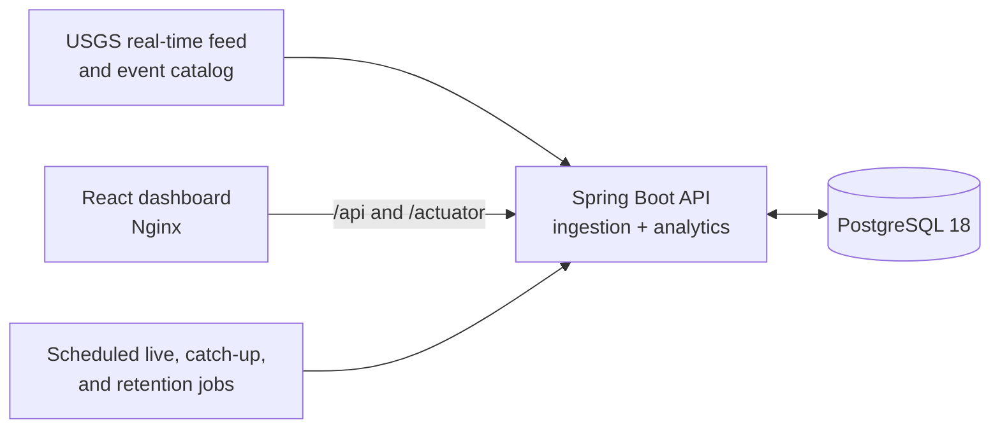

# Quake Scope

Quake Scope is a working full-stack earthquake monitor built around live USGS
data. The browser dashboard combines a global activity map, fast filters,
summary analytics, event details, pipeline health, and on-demand refreshes. The
backend maintains a durable, queryable history in PostgreSQL rather than simply
passing through the latest upstream response.

## Run the product

Requirements: Docker with Compose.

```bash
docker compose up --build
```

Open [http://localhost:3000](http://localhost:3000). The API remains available
directly at [http://localhost:8080](http://localhost:8080), and PostgreSQL is
exposed on port `5432` for local inspection.

The first live-feed import runs at startup. A historical catch-up begins shortly
afterward and pages through the previous 30 days, so the dashboard fills in over
the first few moments. Stop the stack without deleting its database with:

```bash
docker compose down
```

Use `docker compose down --volumes` only when you intentionally want to remove
the stored earthquake history.

Ports can be changed without editing Compose:

```bash
QUAKE_SCOPE_PORT=4000 QUAKE_SCOPE_API_PORT=9090 docker compose up --build
```

In PowerShell, set `$env:QUAKE_SCOPE_PORT` and
`$env:QUAKE_SCOPE_API_PORT` before running the Compose command.

## What is included

- React 19, TypeScript, Vite, Leaflet, and a responsive production dashboard
- Java 17, Spring Boot 4.1, Spring MVC, and WebClient
- PostgreSQL 18, Spring Data JPA, and versioned Flyway migrations
- Scheduled real-time ingestion with retry and idempotent upserts
- Paged 30-day USGS catalog catch-up with one-at-a-time ingestion coordination
- Configurable event and ingestion-run retention
- Filtered database analytics and stable paginated APIs
- Manual refresh with concurrent-run protection
- Nginx same-origin API proxy and SPA fallback
- JUnit/Testcontainers integration tests and Vitest frontend tests
- Container health checks and CI verification for both applications

## Architecture



The API serializes all timestamps in UTC. Ingestion is guarded so a scheduled
live poll, historical catch-up, and manual refresh cannot mutate the event table
at the same time. Event identity comes from the stable USGS event ID; later
source revisions update the existing row and preserve first/last-seen times.

## Local development

Requirements: Java 17, Node.js 24, pnpm 11, and Docker.

Start PostgreSQL and the API:

```bash
docker compose up -d postgres
./mvnw spring-boot:run
```

On Windows PowerShell, use `./mvnw.cmd` or `.\mvnw.cmd`. In another terminal,
start the Vite development server:

```bash
cd frontend
pnpm install
pnpm dev
```

Vite serves the dashboard at [http://localhost:5173](http://localhost:5173) and
proxies `/api` and `/actuator` to the local Spring application.

For an offline, deterministic API dataset, use the fixture profile and disable
scheduled USGS calls:

```bash
./mvnw spring-boot:run -Dspring-boot.run.profiles=fixture \
  -Dspring-boot.run.arguments=--quakescope.ingestion.enabled=false,--quakescope.ingestion.catch-up.enabled=false
```

The fixture imports `src/main/resources/fixtures/usgs/sample-feed.geojson`.
Repeated imports update `last_seen_at` without creating duplicate events.

## Configuration

The defaults are production-like but remain configurable with environment
variables:

| Variable | Default | Purpose |
| --- | --- | --- |
| `USGS_INGESTION_ENABLED` | `true` | Enable the one-minute live-feed poll |
| `USGS_INGESTION_INTERVAL` | `1m` | Delay between live-feed polls |
| `USGS_CATCH_UP_ENABLED` | `true` | Enable historical catalog catch-up |
| `USGS_CATCH_UP_LOOKBACK` | `P30D` | Historical range to maintain |
| `USGS_CATCH_UP_PAGE_SIZE` | `2000` | Events requested per catalog page |
| `USGS_REQUEST_TIMEOUT` | `10s` | Timeout for one USGS request |
| `USGS_MAX_RESPONSE_SIZE` | `16MB` | Maximum buffered USGS GeoJSON response |
| `USGS_MAX_ATTEMPTS` | `3` | Upstream retry attempts |
| `EVENT_RETENTION` | `P90D` | Stored event lifetime |
| `INGESTION_RUN_RETENTION` | `P90D` | Pipeline audit-history lifetime |
| `RETENTION_ENABLED` | `true` | Enable scheduled cleanup |

Spring also accepts `DATABASE_URL`, `DATABASE_USERNAME`, and
`DATABASE_PASSWORD` when the API runs outside Compose.

## API

### `GET /api/v1/earthquakes`

Returns earthquakes newest-first. It accepts Spring-style `page`, `size`, and
`sort` parameters; page size is capped at 100. Filters are composable and
inclusive:

- `minMagnitude` and `maxMagnitude`
- `occurredAfter` and `occurredBefore` as ISO-8601 instants
- `tsunami`, `status`, `alert`, and case-insensitive `placeContains`
- `minLongitude`, `maxLongitude`, `minLatitude`, and `maxLatitude`

Invalid coordinates or inverted ranges return RFC 9457 problem details with
HTTP `400`.

```bash
curl "http://localhost:8080/api/v1/earthquakes?minMagnitude=4.5&size=25"
```

### `GET /api/v1/earthquakes/{usgsId}`

Returns one event by stable USGS ID. A missing ID returns an RFC 9457 response
with HTTP `404`.

### `GET /api/v1/earthquakes/summary`

Computes total events, magnitude coverage, average and maximum magnitude,
tsunami count, average depth, time coverage, and strongest event inside the
same filters accepted by the event list.

### `GET /api/v1/ingestion-runs`

Returns pipeline attempts newest-first, including source (`LIVE_FEED`, `MANUAL`,
or `HISTORICAL`), range, outcome, counts, timestamps, and bounded failure text.

### `POST /api/v1/ingestion-runs/refresh`

Immediately imports the latest USGS feed. It returns processed, inserted,
updated, and unchanged counts. A concurrent ingestion returns HTTP `409`.

```bash
curl -X POST "http://localhost:8080/api/v1/ingestion-runs/refresh"
```

## Verify

Backend verification starts PostgreSQL 18 with Testcontainers, applies all
migrations, imports fixtures, verifies idempotency and data lifecycle behavior,
and exercises the HTTP contract:

```bash
./mvnw verify
```

Frontend verification covers query construction, error handling, formatting,
and filter interactions before producing a strict TypeScript production build:

```bash
cd frontend
pnpm test
pnpm build
```

To verify the deployable stack itself:

```bash
docker compose up --build --wait
curl http://localhost:3000/healthz
curl http://localhost:3000/actuator/health
```

## Data and safety

Quake Scope presents observational data for exploration. A tsunami flag is not
an emergency alert; follow official national and regional authorities for
actionable guidance. Map tiles and attribution are provided by OpenStreetMap.

## License

MIT
